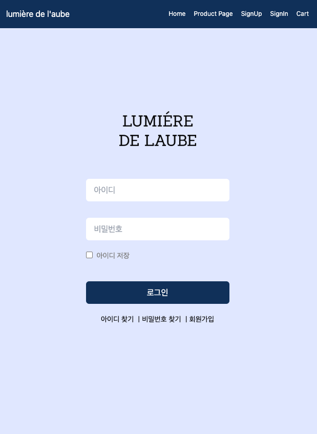

# React 2주차 과제

Router를 이용하여 SPA를 구현하였습니다.  
제작 페이지는 로그인(signIn) 페이지 입니다.  
Home 화면 nav에서 -> SignIn 페이지로 이동해 주세요.

<!-- 테일윈드 설치, 절대 경로 설정 -->



- App.jsx

```jsx
import { createBrowserRouter, RouterProvider } from 'react-router-dom'
import Layout from './layout/Layout'
import SignUp from './pages/SignUp'
import SignIn from './pages/SingIn'
import Cart from './pages/Cart'
import Home from './pages/Home'
import ProductPage from './pages/ProductPage'

const router = createBrowserRouter([
  {
    path: '/',
    element: <Layout />,
    children: [
      { index: true, element: <Home /> },
      { path: 'ProductPage', element: <ProductPage /> },
      { path: 'SignUp', element: <SignUp /> },
      { path: 'SignIn', element: <SignIn /> },
      { path: 'Cart', element: <Cart headline="Cart" /> },
    ],
  },
])

function App() {
  return (
    <>
      <RouterProvider router={router} />
    </>
  )
}

export default App
```

- SingIn.jsx

```jsx
import logo from '@/assets/logo2.png'
import ButtonClick from '@/Component/ButtonClick'
import { useId } from 'react'

function SignIn() {
  const inputId = useId()
  const inputPw = useId()
  const inputCheck = useId()

  return (
    <section className="h-screen p-5 flex flex-col items-center my-28">
      <h2 className="sr-only">회원가입</h2>
      
      <form className="flex flex-col mt-16 mb-10">
        <label htmlFor={inputId}></label>
        <input id={inputId} placeholder="아이디" className="px-4 mb-8 w-[280px] h-[44px] rounded-md" />

        <label htmlFor={inputPw}></label>
        <input id={inputPw} placeholder="비밀번호" className="px-4 h-[44px] rounded-md" />

        <label htmlFor={inputCheck} className="text-sm mt-5 inline-block text-[#828282]">
          <input type="checkbox" name="save" id={inputCheck} className="mr-2 " />
          아이디 저장
        </label>
      </form>
      <ButtonClick label="로그인" size="w-[280px] h-[44px]">
        클릭
      </ButtonClick>
      <form className="flex text-sm mt-5">
        <button type="button">
          아이디 찾기 <span>ㅣ</span>
        </button>
        <button type="button">
          비밀번호 찾기 <span>ㅣ</span>
        </button>
        <button type="button">회원가입</button>
      </form>
    </section>
  )
}

export default SignIn
```
