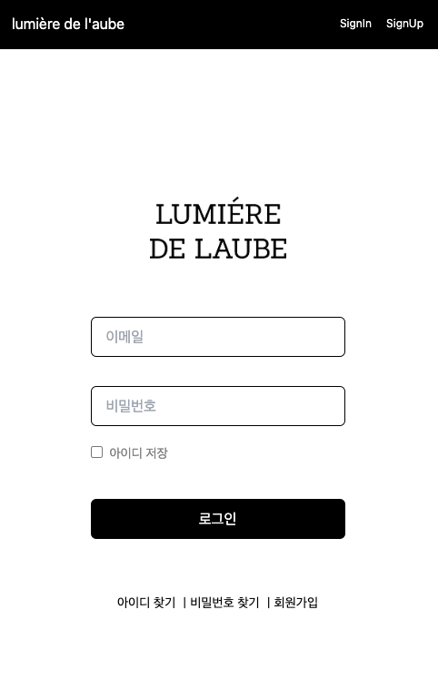
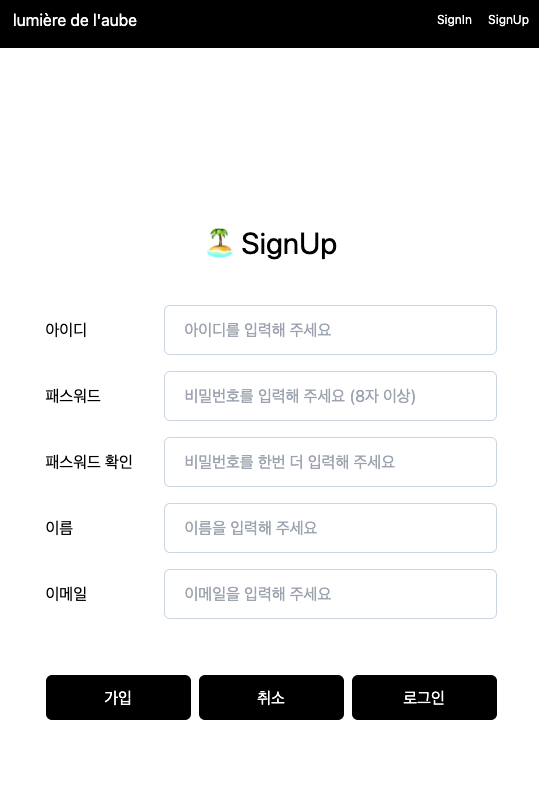

# React 3주차 과제

로그인(signIn), 회원가입(signUp) 페이지 입니다.  
Home nav에서 -> SignUp -> SignIn 페이지로 이동해 주세요.




- 회원가입시 useRef 훅 사용
- 회원가입시 서버에 정보 저장
- 로그인시 메인으로 이동

- SignUp.jsx

```jsx
import pb from '@/api/pocketbase'
import { useRef } from 'react'
import { Link } from 'react-router-dom'
import { useNavigate } from 'react-router-dom'

function SignUp() {
  const navigate = useNavigate()
  const inputName = useRef()
  const userid = useRef()
  const inputEmail = useRef()
  const inpuPass = useRef()
  const inputPassConfirm = useRef()

  const handleRegister = async () => {
    console.log(userid.current.value)

    if (inpuPass.current.value !== inputPassConfirm.current.value) {
      alert('비밀번호가 일치하지 않습니다. 다시 확인해보세요.')
      return
    }

    // PocketBase SDK 인증 요청
    await pb.collection('users').create({
      userid: userid.current.value,
      name: inputName.current.value,
      email: inputEmail.current.value,
      password: inpuPass.current.value,
      passwordConfirm: inputPassConfirm.current.value,
      emailVisibility: true,
    })

    navigate('/')
  }

  return (
    <section className="h-screen p-5 flex flex-col items-center my-28">
      <h2 className="text-center m-10 text-[30px]"> 🏝 SignUp </h2>
      <form onSubmit={handleRegister} className="flex flex-col gap-4 ">
        <div className="flex items-center">
          <label htmlFor={userid} className="w-[110px] h-6">
            아이디
          </label>
          <input type="text" name="userid" placeholder="아이디를 입력해 주세요" ref={userid} className="pl-5 border border-slate-300 ml-2 w-[333px] h-[50px] rounded-md" />
        </div>

        <div className="flex items-center">
          <label htmlFor={inpuPass} className="w-[110px] h-6">
            패스워드
          </label>
          <input type="password" placeholder="비밀번호를 입력해 주세요 (8자 이상)" name="password" ref={inpuPass} className="pl-5 border border-slate-300 ml-2 w-[333px] h-[50px] rounded-md" />
        </div>
        <div className="flex items-center">
          <label htmlFor={inputPassConfirm} className="w-[110px] h-6">
            패스워드 확인
          </label>
          <input type="password" placeholder="비밀번호를 한번 더 입력해 주세요" name="passwordConfirm" ref={inputPassConfirm} className="pl-5 border border-slate-300 ml-2 w-[333px] h-[50px] rounded-md" />
        </div>
        <div className="flex items-center">
          <label htmlFor={inputName} className="w-[110px] h-6">
            이름
          </label>
          <input type="text" placeholder="이름을 입력해 주세요" name="name" ref={inputName} className="pl-5 border border-slate-300 ml-2 w-[333px] h-[50px] rounded-md" />
        </div>
        <div className="flex items-center">
          <label htmlFor={inputEmail} className="w-[110px] h-6">
            이메일
          </label>
          <input type="email" placeholder="이메일을 입력해 주세요" name="email" ref={inputEmail} className=" pl-5 border border-slate-300 ml-2 w-[333px] h-[50px] rounded-md" />
        </div>
        <div className="flex gap-2 justify-center items-center mt-10">
          <button type="submit" className="disabled:cursor-not-allowed w-[145px] h-[45px] bg-black text-white rounded-md">
            가입
          </button>

          <button type="reset" className=" w-[145px] h-[45px] bg-black text-white rounded-md">
            취소
          </button>
          <Link to="/signin">
            <button className="  w-[145px] h-[45px] bg-black text-white rounded-md ">로그인</button>
          </Link>
        </div>
      </form>
    </section>
  )
}

export default SignUp
```

- 다음에 구현해보고 싶은것
  로그인 페이지도 useRef 사용
  로그인 상태유지
  pb에서 데이터 불러오기
  애니메이션 사용
